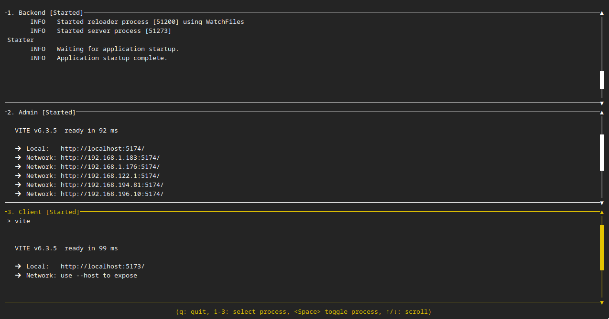

# Starter



## Motivation

The problem that `Starter` solves is running multiple commands at the same time, to:

- Start all the processes with a single command.
- Show in the terminal outputs of all the commands, each one in a different area.
- Allow to stop and restart each command.

When this approach can be useful?

* Simulating distributed systems, each one represented by a running command.
* Setting development environments, where multiple processes need to run at the same time.
* Running multiple commands in parallel, for example, when you need to run a command in multiple folders.

Why not using a simple sheell script?

* It is not easy to show the output of each command in a different area.
* It is not easy to stop and restart each command.

Why not using multiples terminals, `tmux` or `screen`?

* The goal is to have the otuput of each process showing up in the same terminal.
* Avoiding the need to open multiple terminals and running manually each command.

Why not running the commands as system services?

* The goal is to run the commands in a development environment, where you need to see the output of each command.
* It is a user tool, that doesn't require a complex configuration and scalalated privileges.

## Limitations

This program is intented to run just a few commands at the same time (less that
6). It is assumed that this commands are not interactive, i.e. they don't
require user input.

## Installation

Requirements:

* \*nix system (Linux, MacOS, WSL).
* Rust installed (1.70.0 or later).
* Cargo installed (1.70.0 or later).

Clone the repository:

```bash
git clone git@github.com:jailop/starter.git
```

Go to the folder, build and install the program:

```bash
cd starter
cargo build --release
cargo install --path .
```

## Usage

To use this program, you need to create a configuration file that describes the processes you want to run.
The configuration file is a YAML file that contains a list of processes to run. For each process, you need to specify:

* `name`: The name of the process. This a custom name used to identify the
  process in the output.
* `command`: The command to run. This is the command that will be executed.
* `args`: The arguments to pass to the command. This is a list of strings that
  will be passed as arguments to the command.
* `cwd`: The current working directory for the command. This is the directory
  where the command will be executed. Paths can be absolute or relative.

Here is an example:

```yaml
processes:
  - name: "Ping"
    command: "ping"
    args: ["-c", "10", "google.com"]
    cwd: "."

  - name: "List"
    command: "ls"
    args: ["-l", "."]
    cwd: "."
```

Once you have this file, assuming it is named `runner.yaml`, you can run the
following command to start all the processes:

```bash
starter runner.yaml
```

Each process are correlatively starting in 1. Pressing the number key you can stop and restart each process.

To quit, press `q`.


